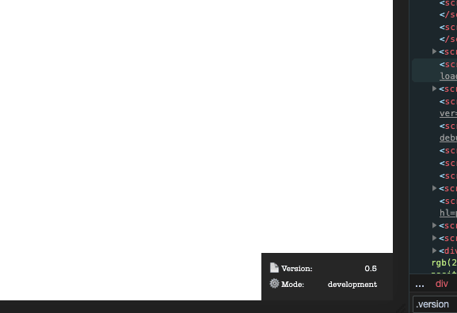

# sw-css-debug

|Name|Status|
|:---|-----:|
|Tags|          extel, bedrock, wordpress
|Tested up to|  5.1.1
|Stable tag|    1.0.0
|License|       MIT
|License URI|   https://www.gnu.org/licenses/gpl-2.0.html
|Plugin Name|   sw-css-debug
|Plugin URI|    https://github.com/sebastianwesolowski/sw-css-debug
|Description|   Small debuger for css
|Author|        Sebastian Wesołowski
|Author URI|    warsztatkodu.pl
|Text Domain|   sw-css-debug
|Domain Path|   /resources/lang
|Version|       1.0.0
|@package|      sw-css-debug

## Description

Small debuger for css

## Changelog

### 1.0.0

- init commit
- On click debuger change collor
- auto add to body class

## TODO

- add image
  <!-- -  -->
